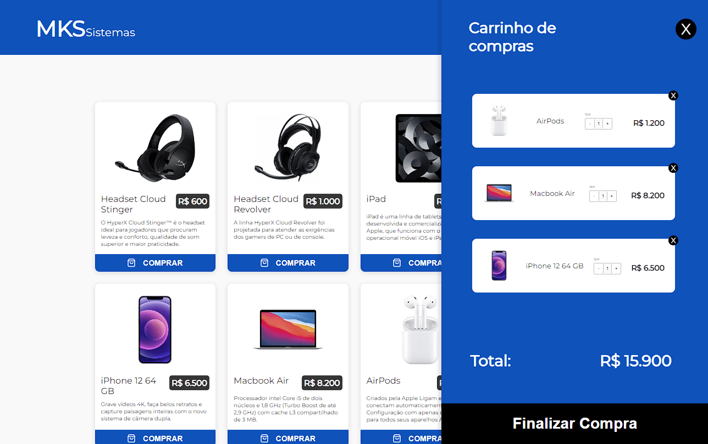

# MKS Front-end Challenge

Check it out here: [https://mks-frontend-challenge-orcin.vercel.app](https://mks-frontend-challenge-orcin.vercel.app)

## 📋 Presentation

This project was developed in January 2023 to meet the frontend challenge proposed by "MKS Desenvolvimento de Sistemas" company, as part of the selection process for the Front-end Developer position. It comprises a product grid and shopping cart for an online store, based on a design created using the Figma tool.

## 🛠️ Technologies Used
- TypeScript
- Next.js
- Redux
- HTML5
- CSS3
- Styled-components
- ESLint
- Prettier

## 📫 Contact

